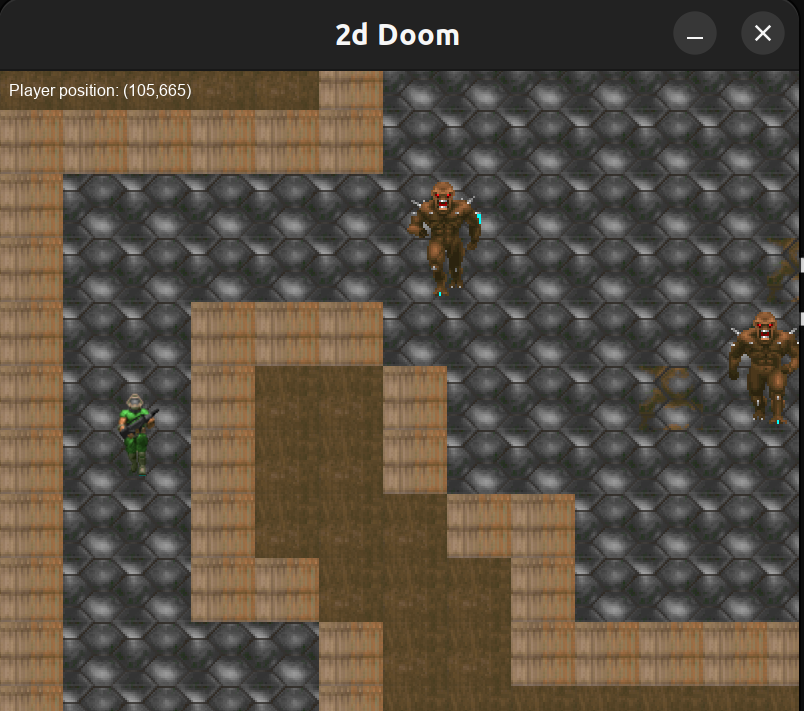

# Doom-inspired 2D Game



## Overview

This project is a 2D game inspired by the classic Doom series, implemented in C++ using the SDL2 (Simple DirectMedia Layer) library. The game aims to capture the essence of fast-paced, intense first-person shooter action within a 2D environment.
Fun fact, the original Doom, released in 1993, is often considered a 3D game, although it employs a unique rendering technique that some might describe as a 2.5D environment. Doom uses a combination of 2D graphics and ray-casting to create the illusion of a three-dimensional space.

## Features

- **Basic oop concepts**: Since this started as a university project I implemented all the concepts that i learned in class.
  
- **The classic assets**: I managed to compile some of the original sprites, tiles and other assets.

- **Level Design**: Although it's not my strong point, I managed to make 3 maps inspired by the classic E1M1.

## Prerequisites

Make sure you have the following dependencies installed:

- [C++ Compiler](https://gcc.gnu.org/) (e.g., GCC)
- [SDL2 Library](https://www.libsdl.org/)
- [SDL2 Image and ttf](https://github.com/libsdl-org)
- [Cmake](https://cmake.org/)

## Build and Run

1. Clone the repository:

    ```bash
    git clone https://github.com/anton1n/sdl2_learning_gamedev2.git
    ```

2. Navigate to the project directory:

    ```bash
    cd doom-2d
    ```

3. Create Build Directory:

    ```bash
    mkdir cmake-build-debug
    ```

4. Navigate to the Build Directory:

    ```bash
    cd cmake-build-debug
    ```

5. Run CMake:
   ```bash
   cmake ..
   ```

6. Build with Make:
   ```bash
   make
   ```

7. Run the resulted file

## Controls

- **WASD**: Move forward, backward, left, and right.
- **CTRL**: Shoot.
- **Esc**: Pause the game.
- **s**: Save the game.
- **l**: Load the game.

## Acknowledgments

- The game is inspired by the classic Doom series developed by id Software.
- Special thanks to the SDL2 community for providing a powerful and versatile multimedia library.
- Big thanks to the following youtoubers: [Let's Make Games](https://www.youtube.com/@CarlBirch) , [codergopher](https://www.youtube.com/@codergopher8270)
- This came as big help: [birch engine](https://github.com/carlbirch/BirchEngine/tree/master)

Enjoy the game! 🚀
